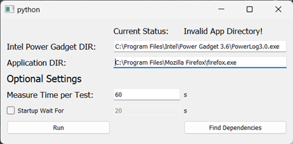
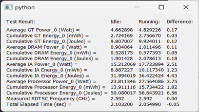

## POWER CONSUMPTION MONITORING
## INTRODUCTION
Power Consumption Monitoring is a Python-based script that uses PyQt5 framework and PowerLog, a command line version of Intel Power Gadget, to accurately measure the power consumption of individual applications on a computer. This tool functions by comparing power usage of the system at idle and during the application's operation.
## Tech Used  
  <p>
    
    
    
  </p>

## DIRECTORY
### File Structure
```
~
├── Documentation                   # User Manual
│    ├── Readme.pdf                        
│    └── Readme.docs                
├── Main.py                         # Entrance of application.
├── Intel.py                        # Intel Power Gadget Controller
├── Utility.py                      # Utility code
├── Design.ui                       # UI Design made by Qt Designer
├── .gitignore
└── README.md
```
### Explanation
1.	Main.py <br>
The entrance of the application.  Contains all the User Interface (UI) design of the application, as well as the UI logic. 
2.	Intel.py <br>
Intel.py contains the code to use Intel Power Gadget (PowerLog) to monitor the power consumption and generate reports, while also contains the code to read and process the data in the report. 
3.	Utility.py <br>
Utility.py contains utility codes which helps to process data in the application. 
4.	Design.ui <br>
Contains the design of the UI. It can only be opened using Qt Designer, which can be downloaded here.

## UI DESIGN
| UI          | Description |
| ----------- | ----------- |
|    | User Input Page       |
|    | Popup Screen        |


## USAGE
### Prerequisite
1.	The code must be run on Windows 10/11. Mac may be possible, but it is not tested.
2.	Must have Python 3.10 installed on the machine. (Installation Guide)
3.	Must have Intel Power Gadget installed on the machine. (Installation Guide)
4.	Recommended to have Poetry installed on the machine. This is to install the dependencies mentioned in the pyproject.toml (Installation Guide)
### Steps (Assuming Poetry is installed)
1.	Unzip the file.
2.	Make sure that the machine is using Python 3.10
3.	In the terminal, type `poetry install` to install the dependencies.
4.	In the terminal, type `poetry run python main.py` to start the program.
*If you do not have Poetry install, you can still refer to pyproject.toml and download the dependencies manually using pip or something similar, just download all the dependencies listed under the section [tool.poetry.dependencies].
